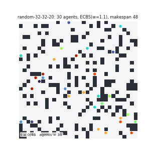
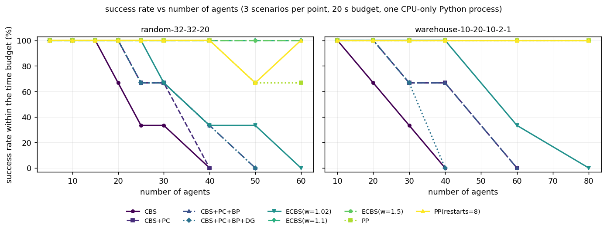
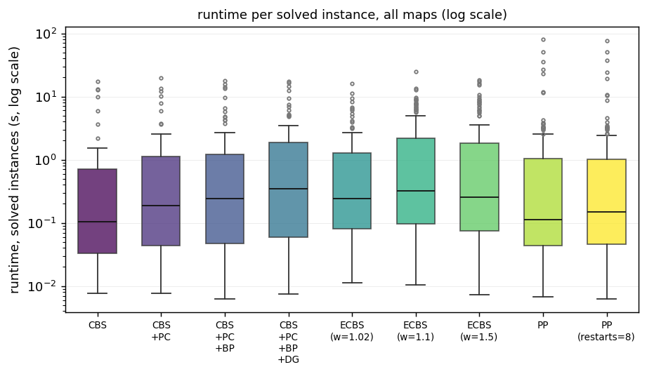
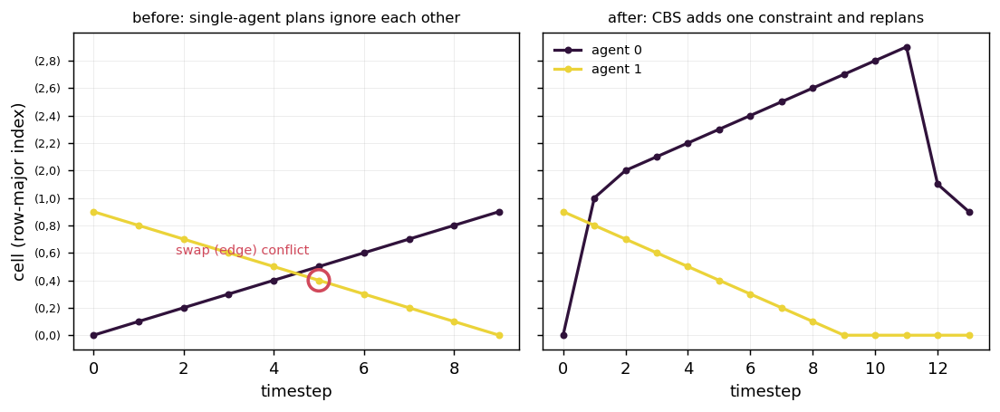
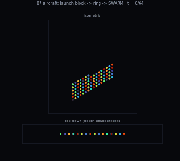
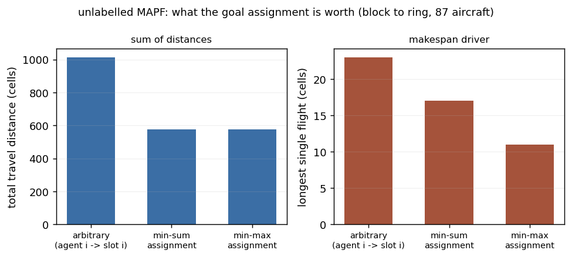
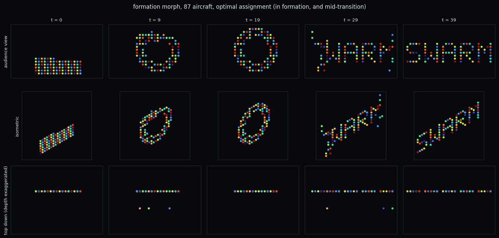

# swarm-path-planning

Plan collision-free paths for a whole fleet at once. A thousand drones have to
fly a choreographed show and none of them may touch; a hundred warehouse robots
have to cross the same aisle; six agricultural drones have to share one field.
This is the solver underneath that, written from scratch on NumPy and measured
on the standard public MAPF benchmark.


No MAPF library, no planning framework, no OMPL. Conflict-Based Search, ECBS,
prioritised planning, the Hungarian algorithm and the execution layer are all
implemented here, and every one of them is checked against something
independent: an exhaustive joint-space search for optimality, SciPy for the
assignment, and the published movingai benchmark instances for the numbers.



30 agents on `random-32-32-20`, the standard small MAPF benchmark map, planned
by ECBS with a suboptimality factor of 1.1: sum-of-costs 637, which is 1.024x a
proven lower bound, makespan 48, solved in 0.4 s. Every frame is generated by
`benchmarks/make_figures.py`; the plan is re-validated afterwards by code that
shares nothing with the solver, and it reports zero conflicts. The same
animation is committed as
[an MP4](benchmarks/output/swarm-demo.mp4) at a tenth of the size.

## The problem

One robot going somewhere is a solved problem: A*, forty lines, done.

The moment there are two, the problem changes shape. Their optimal paths cross,
and now you need a plan for *both* that is collision-free at every instant. With
*k* robots the joint state space is *V^k* -- twenty agents on the 819 free cells
of a 32x32 benchmark map is around 10^58 joint states, with a branching factor
of 5^20 per step. You cannot search that. Finding an optimal sum-of-costs plan
is NP-hard, and the naive fixes fail in specific, expensive ways:

* **Plan them one at a time, each avoiding the last** (prioritised planning) is
  fast and is what a lot of shipped systems do. It is also *incomplete*: there
  are solvable instances it cannot solve in **any** priority order, so no amount
  of retrying rescues it. There is one in the test suite, three cells wide.
* **Re-plan when they collide** deadlocks in a corridor, because the thing that
  has to happen -- one robot backing into an alcove it has no reason to enter --
  is never locally attractive.
* **Give them all different altitudes** works until you have more robots than
  altitudes, and it costs battery for every metre climbed.

The real answer is to decompose: plan agents separately, detect the collisions
in the joint plan, and add the minimum constraint that resolves each one. That
is Conflict-Based Search, and this repository implements it properly -- with the
improvements (prioritising conflicts, bypassing, disjoint splitting, admissible
conflict-graph heuristics) that move it from a textbook algorithm to something
that solves useful instance sizes, plus the bounded-suboptimal variant that real
systems actually run.

## What it does

* **Space-time A\*** with a true-distance heuristic from a backward Dijkstra
  sweep per goal, correct wait actions, and constraint handling that gets edge
  constraints and delayed goal arrival right.
* **CBS**, optimal, with **prioritising conflicts**, **bypassing**, **disjoint
  splitting** and **CG / DG conflict-graph heuristics**, each independently
  switchable so their value can be measured rather than assumed.
* **ECBS**, bounded-suboptimal, focal search at both levels, with a hard
  guarantee: the returned plan costs at most `w` times the optimum. Verified
  against a brute-force optimum for w in {1.0, 1.05, 1.2, 1.5, 2.0, 3.0}.
* **Prioritised planning** and a random-restart variant, as the fast baseline,
  with its incompleteness demonstrated on a constructed instance rather than
  described.
* **Unlabelled (anonymous) MAPF**: when a show morphs between formations, any
  drone may take any slot, so the goal assignment is a minimum-cost matching.
  Our own Hungarian algorithm, plus a bottleneck variant that minimises the
  *longest* flight rather than the total.
* **Execution**: an Action Dependency Graph that keeps the plan safe when a
  vehicle runs late, continuous-time trajectory smoothing under velocity and
  acceleration limits, and an exact minimum-separation check between
  trajectories rather than a per-timestep cell comparison.
* **Measurement**: a sweep over the public benchmark maps with a stated time
  budget, success rate against agent count, runtime distributions, and solution
  cost against a proven lower bound.

## Quickstart

```bash
git clone https://github.com/Pratyush150/swarm-path-planning
cd swarm-path-planning
pip install -e .                 # numpy is the only hard requirement
swarmplan demo                   # no data, no network, about a second
```

Without installing anything, `PYTHONPATH=src python3 -m swarmplan.cli demo` does
the same thing. The figures additionally need `matplotlib` and `pillow`;
everything else runs on NumPy alone.

The benchmark instances and the figures need the public benchmark set:

```bash
python3 tools/fetch_benchmarks.py --all       # ~19 MB from movingai.com
swarmplan solve --map random-32-32-20 --agents 20     # every algorithm, one instance
swarmplan execute --agents 30 --delayed 2             # plan it, then fly it late
python3 benchmarks/run.py --quick             # a few minutes
python3 benchmarks/make_figures.py --all      # the animations and charts
```

## How it works

```
                  .map / .scen                formations (ring, text, block)
                       |                                  |
                       v                                  v
              +-----------------+              +------------------------+
              |  GridMap /      |              |  assignment/           |
              |  Grid3D         |              |  Hungarian matching    |
              |  (SearchGraph)  |              |  min-sum or min-max    |
              +-----------------+              +------------------------+
                       |                                  |
                       |     starts, goals  <-------------+
                       v
        +--------------------------------------------------+
        |                   HIGH LEVEL                      |
        |  CBS: constraint tree, best-first on cost         |
        |    conflict detection (vertex + swap)             |
        |    conflict classification via MDDs               |
        |    CG / DG heuristic = min vertex cover           |
        |  ECBS: OPEN on lower bound, FOCAL on conflicts    |
        |  PP:   fixed priority order, no tree              |
        +--------------------------------------------------+
                       |  "agent 3 may not be at cell 91 at t=12"
                       v
        +--------------------------------------------------+
        |                   LOW LEVEL                       |
        |  space-time A* over (vertex, timestep)            |
        |  backward-Dijkstra true-distance heuristic        |
        |  focal variant for ECBS (bounded suboptimal)      |
        +--------------------------------------------------+
                       |  one path per agent
                       v
        +--------------------------------------------------+
        |                  EXECUTION                        |
        |  Action Dependency Graph: orderings, not clocks   |
        |  Catmull-Rom smoothing under v_max / a_max        |
        |  exact continuous-time separation check           |
        +--------------------------------------------------+
```

The data flow in one paragraph: a map and a scenario file become a graph plus
node ids for each start and goal. The high level plans every agent
independently, simulates the joint plan, finds the first collision, and splits
the search into two children that each forbid one of the two agents from the
conflicting cell at that timestep -- replanning only that agent with the low
level. That repeats, best-first on cost, until a node has no conflicts; because
the search is best-first and every split covers all solutions of its parent, the
first conflict-free node is optimal. The resulting paths then go through the
execution layer, which discards the absolute timing, keeps the orderings, and
turns the grid steps into a speed- and acceleration-limited trajectory whose
minimum pairwise separation is checked in continuous time.

Why each algorithm is built the way it is, including the MDD machinery behind
cardinal conflicts and the admissible conflict-graph heuristics, is in
[docs/algorithms.md](docs/algorithms.md).

## Worked example

`swarmplan demo`, pasted verbatim. Five agents, two rooms, one single-cell door
between them:

```
map: 9x10, 73 free cells, one door between the rooms
agents: 5   sum of individual optimal distances (lower bound): 57

CBS              solved   sum-of-costs=  65 (1.140 x lower bound)  makespan= 19  high-level nodes=  617  0.203s
CBS+PC+BP+DG     solved   sum-of-costs=  65 (1.140 x lower bound)  makespan= 19  high-level nodes=   54  0.070s
ECBS(w=1.2)      solved   sum-of-costs=  67 (1.175 x lower bound)  makespan= 20  high-level nodes=   15  0.011s
PP               solved   sum-of-costs=  74 (1.298 x lower bound)  makespan= 22  high-level nodes=    0  0.001s

independent validation of the optimal plan: 0 problems found

optimal plan, sampled (agents a-e, # obstacle):

   t=0          t=4          t=8          t=11         t=15         t=19      
   c........d   .....d....   ..........   ......e...   ......e...   ......e...
   ....##....   ....##....   ....##....   ....##....   ....##....   ....##....
   ....##....   ..ca##....   ...d##....   ....##....   ....##....   ....##....
   ..a.......   ....b.....   ..b.a.e...   ..b.......   ..b.......   ..b.......
   ####.#####   ####.#####   ####c#####   ####d#####   ####.#####   ####.#####
   ......b...   ....e.....   ..........   .....ac...   ......a...   ......a...
   ....##....   ....##....   ....##....   ....##....   ....##....   ....##....
   ....##....   ....##....   ....##....   ....##....   ...d##....   ....##....
   ...e......   ..........   ..........   ..........   .......c..   d........c

agent 0 delayed 3 ticks at step 2:
  fixed timetable execution: 3 collisions, 19 ticks
  dependency-graph execution: 0 collisions, 21 ticks

continuous-time execution check (2 m cells, 3 m/s, 2 m/s^2):
  agents: 5
  duration: 30.08 s (time scale 1.58)
  peak speed: 1.47 m/s (limit 3.00)
  peak acceleration: 2.00 m/s^2 (limit 2.00)
  closest approach: 1.299 m (required 1.000)
  violations: 0
```

Four things worth reading twice in that output. The four algorithms disagree by
14% in cost and by two orders of magnitude in runtime, on five agents. The
improvements cut CBS's constraint tree from 617 nodes to 54. Delaying one agent by three
ticks turns a valid plan into three collisions if you dispatch it as a
timetable, and into a two-tick delay if you dispatch it as an ordering. And a
plan that is perfectly legal on the grid comes within 1.30 m in continuous time,
which passes a 1 m separation requirement and fails a 1.5 m one.

## Measured results

Every number below comes from `benchmarks/run.py` on the public benchmark
instances, on **one CPU-only laptop-class machine** (Intel i5-1135G7, CPython
3.10, one process), with a **20 second budget per instance** and **3 scenarios
per point** -- scenario files `random-1/2/3`, taking the first *k* start/goal
pairs of each, which is the standard convention. 1,119 runs, 91 minutes, nine
algorithm configurations, seven maps:

| map | size | free cells | agent counts run |
|---|---|---|---|
| `empty-32-32` | 32x32 | 1024 | 10, 20, 30, 40, 50, 60, 80, 100 |
| `random-32-32-20` | 32x32 | 819 | 5, 10, 15, 20, 25, 30, 40, 50, 60 |
| `room-32-32-4` | 32x32 | 682 | 5, 10, 15, 20, 25, 30, 40 |
| `maze-32-32-2` | 32x32 | 666 | 4, 6, 8, 10, 12, 16, 20 |
| `den312d` | 81x65 | 2445 | 10, 20, 30, 40, 60, 80 |
| `warehouse-10-20-10-2-1` | 63x161 | 5699 | 10, 20, 30, 40, 60, 80 |
| `Berlin_1_256` | 256x256 | 47540 | 20, 50, 100, 150 (ECBS and PP only) |

Of the 1,074 runs actually executed, **897 solved, 170 hit the time budget, 7
were prioritised-planning failures, and 0 produced an invalid plan** -- every
returned plan is re-validated from the paths alone by code that shares nothing
with the solvers.

### Success rate against agent count



`random-32-32-20`, the standard small MAPF map (percentage of 3 instances
solved within 20 s):

| algorithm | 5 | 10 | 15 | 20 | 25 | 30 | 40 | 50 | 60 |
|---|---|---|---|---|---|---|---|---|---|
| CBS | 100% | 100% | 100% | 67% | 33% | 33% | 0% | - | - |
| CBS+PC | 100% | 100% | 100% | 100% | 67% | 67% | 0% | - | - |
| CBS+PC+BP | 100% | 100% | 100% | 100% | 67% | 67% | 33% | 0% | - |
| CBS+PC+BP+DG | 100% | 100% | 100% | 100% | 67% | 67% | 33% | 0% | - |
| ECBS(w=1.02) | 100% | 100% | 100% | 100% | 100% | 67% | 33% | 33% | 0% |
| **ECBS(w=1.1)** | 100% | 100% | 100% | 100% | 100% | 100% | 100% | 100% | **100%** |
| ECBS(w=1.5) | 100% | 100% | 100% | 100% | 100% | 100% | 100% | 100% | 100% |
| PP | 100% | 100% | 100% | 100% | 100% | 100% | 100% | 67% | 67% |
| PP(restarts=8) | 100% | 100% | 100% | 100% | 100% | 100% | 100% | 67% | 100% |

`warehouse-10-20-10-2-1`, the fulfilment-centre layout:

| algorithm | 10 | 20 | 30 | 40 | 60 | 80 |
|---|---|---|---|---|---|---|
| CBS | 100% | 67% | 33% | 0% | - | - |
| CBS+PC | 100% | 100% | 67% | 67% | 0% | - |
| CBS+PC+BP | 100% | 100% | 67% | 67% | 0% | - |
| CBS+PC+BP+DG | 100% | 100% | 67% | 0% | - | - |
| ECBS(w=1.02) | 100% | 100% | 100% | 100% | 33% | 0% |
| **ECBS(w=1.1)** | 100% | 100% | 100% | 100% | 100% | **100%** |
| ECBS(w=1.5) | 100% | 100% | 100% | 100% | 100% | 100% |
| PP | 100% | 100% | 100% | 100% | 100% | 100% |
| PP(restarts=8) | 100% | 100% | 100% | 100% | 100% | 100% |

`Berlin_1_256`, 256x256 and 47,540 free cells, ECBS and prioritised planning
only (optimal CBS was not run at this scale):

| algorithm | 20 | 50 | 100 | 150 |
|---|---|---|---|---|
| ECBS(w=1.1) | 100% | 67% | 33% | 0% |
| ECBS(w=1.5) | 100% | 100% | 33% | 0% |
| PP | 100% | 100% | 100% | 100% |
| PP(restarts=8) | 100% | 100% | 100% | 100% |

A dash means the algorithm had already solved nothing at a lower agent count on
that map and was not run again there. The full nine-by-seven set of tables is
regenerated into `benchmarks/output/tables.md` by every sweep.

### What each CBS improvement is worth

Two views, because they say different things. First, over the **57 instances
that all four CBS variants solved** -- so the comparison is like for like:

| variant | mean high-level nodes | median runtime | mean sum-of-costs |
|---|---|---|---|
| CBS | 98 | 0.10 s | 464.4 |
| CBS+PC | **12** | 0.12 s | 464.4 |
| CBS+PC+BP | 13 | 0.14 s | 464.4 |
| CBS+PC+BP+DG | **10** | 0.21 s | 464.4 |

Prioritising conflicts alone cuts the constraint tree by 8x. Adding the DG
heuristic takes it down another 20%. And on these instances all of that makes
the solver *slower*, because each node now costs an MDD construction and a
vertex-cover computation, and the tree was already small enough. The costs are
identical to the last unit, as they must be -- every variant is optimal.

Second, over everything that was attempted, which is where the point is:

| variant | instances solved |
|---|---|
| CBS | 57 / 87 |
| CBS+PC | 68 / 99 |
| CBS+PC+BP | 70 / 102 |
| CBS+PC+BP+DG | 70 / 102 |

The improvements do not make easy instances faster. They make hard instances
**possible**, which is the only thing that shows up in a success-rate curve.

Where the map has real bottlenecks they pay on both counts. On
`room-32-32-4` -- rooms joined by one-cell doorways -- over all solved runs:

| variant | solved | median runtime | mean high-level nodes | mean low-level expansions |
|---|---|---|---|---|
| CBS | 10/15 | 0.55 s | 413 | 84,430 |
| CBS+PC | 12/18 | 0.14 s | 69 | 31,225 |
| CBS+PC+BP | 12/18 | 0.17 s | 65 | 30,808 |
| CBS+PC+BP+DG | 12/18 | 0.33 s | **28** | **17,022** |

A 15x smaller tree with the full stack, and a 4x faster median with prioritised
conflicts alone. That is what prioritising cardinal conflicts is for: in a
doorway almost every conflict is cardinal, and splitting on the ones that are
not just widens the tree for nothing.

### The suboptimality tradeoff in ECBS

Over the 90 instances every ECBS configuration solved:

| w | median runtime | mean cost / lower bound | mean high-level nodes |
|---|---|---|---|
| 1.02 | 0.243 s | 1.0070 | 11.5 |
| 1.10 | 0.186 s | 1.0102 | 3.5 |
| 1.50 | 0.127 s | **1.0113** | 2.7 |

The guarantee at w=1.5 allows a solution 50% above optimal. The measured cost is
**1.1% above a proven lower bound**, and half the runtime of w=1.02. That gap
between the bound and the reality is the entire practical argument for
bounded-suboptimal search, and it is why a real system runs ECBS and not CBS.

Solution quality by map, over all solved runs (cost relative to the sum of true
single-agent optima, so 1.000 is provably optimal):

| map | CBS | ECBS(w=1.1) | ECBS(w=1.5) | PP |
|---|---|---|---|---|
| empty-32-32 | 1.000 | 1.007 | 1.007 | 1.062 |
| random-32-32-20 | 1.008 | 1.026 | 1.028 | 1.063 |
| room-32-32-4 | 1.012 | 1.042 | 1.060 | 1.080 |
| maze-32-32-2 | 1.002 | 1.011 | 1.012 | 1.015 |
| den312d | 1.002 | 1.017 | 1.019 | 1.053 |
| warehouse-10-20-10-2-1 | 1.000 | 1.003 | 1.004 | 1.063 |
| Berlin_1_256 | - | 1.000 | 1.000 | 1.019 |

Prioritised planning lands between 0.4 and 6 percentage points above ECBS on
cost, which for most operators is nothing -- and it is the only algorithm here
that solved every `Berlin_1_256` instance, up to 150 agents. It also outright
failed on 7 instances (5 of them on the maze and the room map) that other
planners solved, which is exactly the trade it makes: no search tree, no
guarantee.

### Runtime distribution



Solved instances only, log scale. Counting a timed-out run as "took 20 s" would
flatter the slow algorithms, so those runs are excluded from every runtime
figure and appear only in the success rates.

### Reading these numbers honestly

* **Python, one CPU, one machine.** A tuned C++ implementation -- EECBS is the
  reference -- is far faster than this, and we have not run it. Nothing here is
  a claim about matching it. What transfers is the *shape*: optimal CBS collapses
  first, the improvements push it out by roughly one agent-count step, and
  bounded-suboptimal search moves the tractable range by a factor, which is the
  qualitative picture the MAPF literature reports on these same maps.
* **The time budget is checked between high-level expansions**, so a run can
  overshoot it. Measured over the 170 timed-out runs: median 20.2 s, worst
  48.0 s on a 20 s budget. The worst cases are all `Berlin_1_256` with 100-150
  agents, where one high-level node means replanning across 47,540 cells --
  that run expanded 5 high-level nodes and 2.0 million low-level states before
  the deadline was next checked.
* **Runtime includes the instance's heuristic tables.** Each run builds its own,
  so no algorithm benefits from another's cache. On `Berlin_1_256` that alone is
  several seconds at 150 agents, which is why prioritised planning's median
  across the Berlin runs is 9.6 s rather than milliseconds.
* **Prioritised planning checks its deadline between restart attempts, not
  inside one.** A single pass is *k* single-agent searches and is normally
  milliseconds, so this never mattered until `Berlin_1_256`: its 150-agent runs
  took 24 s, 35 s and 80 s and are recorded as solved, while ECBS at the same
  size was cut off at 20 s. Read that row as "prioritised planning finished the
  instance and ECBS did not finish within the budget", not as a like-for-like
  time comparison. Every other map's PP runs are well inside the budget.
* **Success rate is over 3 scenarios per point**, so it moves in steps of 33%.
  More scenarios would smooth the curves; the time budget for this sweep was
  already 91 minutes.

The full method, including how the lower bound is computed and why the `.scen`
octile column is not it, is in [docs/benchmarks.md](docs/benchmarks.md).

## One conflict, drawn



Two agents swapping ends of a corridor with one bypass, in space-time: time
across, cell up the side. On the left, their independently optimal paths cross
at t=5 -- and note *what kind* of collision it is. They are never in the same
cell at the same timestep; they swap cells across an edge, which a per-timestep
position check declares valid and two real quadrotors would settle by flying
through each other. On the right, CBS has added one constraint: agent 0 waits
two steps, takes the lower corridor (the jump to the `(2,x)` band), and both
arrive. Produced by `benchmarks/make_figures.py --conflict`.

## Drone light shows: when any drone can take any slot



(also committed as [an MP4](benchmarks/output/formation-morph.mp4))

A light show is not a labelled MAPF instance. The choreography says *where the
aircraft must be*, not which airframe goes where -- so the first decision is the
assignment, and it dominates everything downstream. Measured on the block-to-ring
transition of the show above, 87 aircraft in a 36 x 7 x 18 airspace:

| goal assignment | total travel | longest single flight |
|---|---|---|
| arbitrary (aircraft *i* to slot *i*) | 1015 cells | 23 cells |
| minimum-sum matching (Hungarian) | **577 cells** | 17 cells |
| minimum-max matching (bottleneck) | 577 cells | **11 cells** |



The arbitrary assignment flies **1.76x further in total** for the identical
formation, and its worst aircraft flies twice as far as it needs to. On the
ring-to-text transition of the same show the ratio is **2.05x**. That is before
any conflict resolution: a swarm assigned this badly also generates far more
conflicts for the planner to resolve, so the cost compounds.

Minimum-sum and minimum-max are different objectives and the table shows why it
matters. A show is not in formation until the *last* drone arrives, so the
bottleneck assignment -- same total distance here, but a longest flight of 11
cells instead of 17 -- is usually the one an operator wants.



Three projections of the same show: the audience view, the isometric view, and
the top-down view where the traffic actually is. In formation every aircraft
sits in the display plane; between formations they use the depth axis to get out
of each other's way, which is the half of the problem the audience never sees.

The whole show -- 87 aircraft, three transitions, launch block to ring to text
and back to the block so the animation loops -- is planned in 8.5 s by ECBS with
w=1.2, and the concatenated plan validates with zero conflicts. Reproduce it with
`python3 benchmarks/make_figures.py --morph`, or plan the same formations
without the return leg with `swarmplan show`.

## Executing the plan when a vehicle is late

A MAPF plan is a timetable, and a timetable is a lie the moment one vehicle is
late. The failure is not "the plan finishes late" -- it is **collision**, because
the vehicle that was supposed to have vacated a cell is still in it when the
next one arrives on schedule.

The fix is to keep the *orderings* the plan implies and throw away the clock. If
agent B was scheduled to enter a cell after agent A left it, B waits for A to
actually leave. That is the Action Dependency Graph, and executing it means a
late agent delays exactly the agents behind it and nobody else -- while no
ordering, and therefore no collision the planner ruled out, can occur.

The test suite delays one agent by 1, 3 and 7 ticks at every step of a plan and
asserts that the ADG execution stays collision-free while the fixed-timetable
execution of the same plan does not. `swarmplan execute` does it on a real
benchmark instance -- 30 agents on `random-32-32-20`, two of them five ticks
late:

```
random-32-32-20, 30 agents, ECBS(w=1.1): sum-of-costs 637, makespan 48
dependency graph: 869 ordering edges, 232 of them between different agents
delaying 2 agents by 5 ticks each (seed 0):
  fixed timetable execution:    2 collisions, 48 ticks
  dependency-graph execution:   0 collisions, 48 ticks

continuous-time check of the delayed execution (2 m cells, 3 m/s, 2 m/s^2):
  agents: 30
  duration: 61.92 s (time scale 1.29)
  peak speed: 1.80 m/s (limit 3.00)
  peak acceleration: 2.00 m/s^2 (limit 2.00)
  closest approach: 0.975 m (required 1.500)
  violations: 6
    agents 0/11 at t=26.59s separated by 0.994 m
```

Two collisions become none, and in this instance the delay costs nothing at all
in makespan because the late agents were not on anyone's critical path.

The last block is the more interesting half. That plan is *legal on the grid* --
zero conflicts, validated -- and in continuous time six pairs come closer than
1.5 m on 2 m cells, because two agents on adjacent cells passing in opposite
directions are one cell apart in the middle of the step. If the airframe needs
1.5 m of separation, the grid resolution is wrong, and this is where you find
that out rather than in the air.

The layer above that turns grid steps into something an airframe can fly:
corner smoothing with a hard cap on how far a waypoint may move (the cap is what
keeps the smoothed path inside the corridor the planner cleared), Catmull-Rom
interpolation, and a single exact time-scaling factor that brings peak speed and
peak acceleration under their limits. Separation is then checked in continuous
time and exactly -- between two samples both agents move linearly, so the
closest approach has a closed form, and sampling distances at the sample points
alone would miss precisely the mid-step crossing that matters.

See [docs/execution.md](docs/execution.md).

## What this handles that a tutorial does not

* **Swap conflicts.** Two agents exchanging cells share no cell at any timestep.
  A per-timestep position check calls that plan valid. It is a collision. Every
  conflict check here tests both cases and a test asserts the difference.
* **Agents parked on their goals.** An agent that has arrived still occupies its
  cell forever. Plans are therefore compared out to the longest path, not each
  agent's own length, and a later agent that walks over an arrived agent's goal
  is in conflict.
* **Goals that are not available yet.** If a constraint forbids the goal cell at
  t=12, an agent arriving at t=9 has to leave and come back. The low-level
  search only accepts a goal state at or after the last constrained timestep on
  that goal.
* **Manhattan distance being useless on real maps.** It is admissible and it is
  badly uninformed. On `maze-32-32-2`, over 150 benchmark queries, A* guided by
  the true distance expands 8,508 states and the same A* guided by Manhattan
  expands 893,969 -- measured, by `tools/heuristic_report.py`.
* **The `.scen` optimal column not being the bound you think.** It is the
  8-connected octile distance, and MAPF is solved 4-connected, so it sits
  systematically *below* the true single-agent optimum. Ratios here are measured
  against the sum of true 4-connected distances, which is a genuine lower bound;
  the octile column is carried alongside for reference. A test asserts both the
  bound and its looseness.
* **Incomplete baselines reporting failure honestly.** Prioritised planning that
  fails returns `failed`, never `unsolvable`: it has proved nothing about the
  instance. Equally, CBS on a genuinely unsolvable instance does not terminate
  -- it keeps adding constraints -- so it returns `timeout`, and a test asserts
  that it never claims otherwise.
* **Bounded suboptimality that is actually bounded.** ECBS's `w` is a guarantee
  derived from the lower bounds the focal searches return, checked against a
  brute-force optimum in the test suite rather than assumed.

## Limitations

Stated plainly, because this is the section that decides whether the rest is
trustworthy.

* **Grid abstraction.** 4-connected 2D grids and 6-connected 3D boxes, unit-cost
  moves, discrete timesteps. Real airspace is continuous; a grid is a modelling
  choice, and it is the same choice the entire MAPF benchmark literature makes.
* **CPU-only Python timings.** Every runtime here is from a single-threaded
  CPython process on one laptop-class machine (Intel i5-1135G7). A tuned C++
  implementation such as EECBS is far faster -- comparing our seconds to theirs
  would be meaningless, and we do not. What is comparable is the shape: which
  algorithm survives to which agent count, and what each improvement is worth.
* **Discrete time.** No continuous-time conflict reasoning (no SIPP, no CCBS),
  so the plan is only as fine-grained as the timestep.
* **No aerodynamics.** No downwash, no wake, no wind, no battery model. A real
  multirotor descending through another's wake is a hazard the grid knows
  nothing about; light shows have vertical separation rules for that reason.
* **Kinematics only in the smoothing layer.** The search itself has no
  orientation, no turning radius and no acceleration model. Smoothing is applied
  afterwards and slows every agent by one shared factor, which preserves the
  plan's orderings but is not time-optimal.
* **No WDG heuristic, no MAPF-LNS, no lifelong MAPF.** The strongest known
  admissible CBS heuristic, the large-neighbourhood search that dominates very
  large instances, and continuous re-tasking are all out of scope here.
* **Scale.** What we measured is up to 100 agents on 32x32 maps, 80 on the
  warehouse map, 150 on a 256x256 city map, and 87 aircraft in the 3D light
  show. A commercial show flying thousands of aircraft is a different
  engineering problem and it would need a different implementation language
  before it needed a different algorithm.

## Where this maps commercially

Multi-agent path finding is not an academic curiosity; it is the algorithm
underneath several product categories. Naming them is a statement about the
problem domain, not a claim of any relationship with the companies.

* **Drone light shows.** Operators flying formations of a thousand aircraft and
  more -- Damoda, High Great and EHang in China among the best known -- are
  solving unlabelled MAPF between formations, exactly the problem in the section
  above, plus separation and battery constraints this repository does not model.
* **Military and ISR swarming.** Multi-vehicle operations in the Indian ecosystem
  (ideaForge in ISR platforms, NewSpace Research in swarm work) need
  deconflicted multi-vehicle plans with the same structure.
* **Warehouse robot fleets.** Geek+, Quicktron and Amazon Robotics run hundreds
  to thousands of AMRs through shared aisles. This is the largest commercial
  MAPF market by far, and the benchmark set includes the warehouse layouts to
  match -- `warehouse-10-20-10-2-1` is in our sweep for that reason.
* **Multi-drone agricultural coverage.** Several sprayers sharing a field
  (Garuda Aerospace, XAG) is a coverage problem on top of a MAPF problem, and
  the underlying deconfliction is what is here.

The gap between this repository and any of those products is domain modelling --
downwash, batteries, radio scheduling, geofences, certification -- not the
planning core.

## Repository layout

```
src/swarmplan/
  graph.py          SearchGraph, GridMap (.map parser), Grid3D
  scenarios.py      .scen parser, instance construction
  datasets.py       benchmark registry: URLs, sizes, SHA-256
  constraints.py    constraints, constraint tables, reservations
  conflicts.py      vertex + swap detection, classification, plan validation
  solution.py       what every solver returns
  metrics.py        sum-of-costs, makespan, lower bounds, aggregation
  planners.py       algorithm spec strings ("ecbs:w=1.1")
  lightshow.py      formations, transitions, whole-show planning
  viz.py            figures and animations (matplotlib optional)
  cli.py            swarmplan demo | solve | execute | show | data
  lowlevel/         heuristic.py, astar.py, focal.py
  cbs/              mdd.py, heuristics.py, solver.py
  ecbs/             solver.py
  prioritised/      planner.py
  assignment/       hungarian.py, anonymous.py, formations.py
  execution/        adg.py, smoothing.py, separation.py
tools/              fetch_benchmarks.py, heuristic_report.py
benchmarks/         run.py (the sweep), make_figures.py, output/
config/             sweep configurations
docs/               algorithms.md, benchmarks.md, execution.md
tests/              22 test files
.github/workflows/  tests.yml (runs the suite on 3.10, 3.11, 3.12)
```

## Tests

```bash
python3 -m pytest -q          # 224 tests, 22 files, about half a minute
```

Offline and deterministic. Tests that need the benchmark archives skip
themselves when the data is absent: a clone with no data runs 213 of them and
skips 11, so `git clone && pytest` works with nothing downloaded. What they
prove, rather than merely exercise:

* space-time A* returns the hand-checkable optimum, respects vertex and edge
  constraints separately, and waits when the goal is not yet available;
* the backward-Dijkstra heuristic is admissible **and consistent** on a map with
  obstacles, checked edge by edge against an independent per-node search;
* vertex and swap conflicts are both detected, including the swap case where no
  cell is ever shared;
* **CBS returns the optimal sum-of-costs**, checked against an exhaustive
  joint-space search written independently of the solvers, on four instances,
  for all ten combinations of the improvements;
* ECBS with factor `w` returns a solution within `w` times that same brute-force
  optimum, for six values of `w`, and its reported lower bound never exceeds the
  optimum;
* prioritised planning fails on a constructed instance in **both** priority
  orders where CBS succeeds, and random restarts cannot rescue it;
* our Hungarian implementation matches `scipy.optimize.linear_sum_assignment` in
  total cost on 250 random matrices, square and rectangular;
* the optimal assignment beats the identity assignment on a formation morph, and
  the bottleneck variant beats both on longest-flight;
* the execution schedule keeps every agent collision-free when one is delayed by
  1, 3 or 7 ticks at any step, while the fixed-timetable execution of the same
  plan collides;
* smoothed trajectories respect their velocity and acceleration limits, never
  move a waypoint beyond its deviation cap, and the continuous-time separation
  check catches an approach that grid checking passes.

## Related work

Other repositories of ours that this sits next to:

| repo | what it is |
|---|---|
| [ros2-drone-bringup](https://github.com/Pratyush150/ros2-drone-bringup) | ROS 2 PX4 bringup: geodesy, missions, geofence, state machine, SITL -- where a plan like this would be executed |
| [stereo-visual-slam](https://github.com/Pratyush150/stereo-visual-slam) | Stereo visual odometry and SLAM measured against KITTI ground truth |
| [robot-sim-test-harness](https://github.com/Pratyush150/robot-sim-test-harness) | Scenario-driven regression testing for robots in simulation |
| [drone-control-toolkit](https://github.com/Pratyush150/drone-control-toolkit) | PID/LQR/EKF control and estimation with a simulation harness |
| [pose-graph-slam](https://github.com/Pratyush150/pose-graph-slam) | Pose-graph SLAM back end on NumPy, cross-checked against GTSAM |

## References

The algorithms here are from the published literature; the implementation is
ours.

* Sharon, Stern, Felner, Sturtevant, *Conflict-Based Search for optimal
  multi-agent pathfinding*, AIJ 2015.
* Barer, Sharon, Stern, Felner, *Suboptimal variants of the Conflict-Based
  Search algorithm*, SoCS 2014 (ECBS).
* Boyarski et al., *ICBS: Improved Conflict-Based Search*, IJCAI 2015
  (prioritising conflicts, bypassing).
* Felner et al., *Adding heuristics to Conflict-Based Search*, ICAPS 2018 (CG,
  DG, WDG).
* Li, Harabor, Stuckey, Ma, Koenig, *Disjoint splitting for Multi-Agent Path
  Finding with Conflict-Based Search*, ICAPS 2019.
* Li, Ruml, Koenig, *EECBS: A bounded-suboptimal search for Multi-Agent Path
  Finding*, AAAI 2021. Reference implementation:
  [Jiaoyang-Li/EECBS](https://github.com/Jiaoyang-Li/EECBS).
* Hoenig et al., *Multi-Agent Path Finding with Kinematic Constraints*, ICAPS
  2016 (temporal plan graph / action dependency graph).
* Stern et al., *Multi-Agent Pathfinding: Definitions, Variants, and
  Benchmarks*, SoCS 2019. Benchmark set:
  [movingai.com/benchmarks/mapf](https://movingai.com/benchmarks/mapf/).

## Licence

MIT. See [LICENSE](LICENSE).
